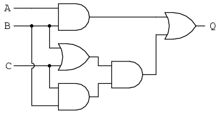
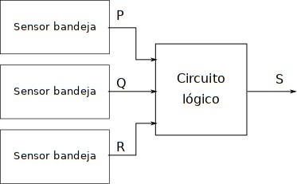

# 2020-1 AV1 Simulado

**Avaliação 1 - Elementos de Sistemas - 20 pts HW**

1. Teórica (blackboard)
1. Prática (github)

Você possui um total de 1h20 para realizar a avaliação, você pode decidir
como usar o seu tempo.

Nessa avaliação iremos usar um sistema de verificação de plágio chamado
proctorio, por conta disso, vocês devem utilizar o chrome no SSD. 

- **Trabalhar sozinho**
- **80 min**
- **Ficar conectado no canal geral (para ouvir instruções)**
- **LEMBRE DE REALIZAR COMMIT (A CADA QUESTÃO) E DAR PUSH AO FINALIZAR**

# Parte prática

## Começando

Você deve:

1. clonar o repositório que foi gerado pelo link (e trabalhar nele)
1. editar o arquivo `ALUNO.json`
1. não esqueça de dar `commit` e `push` a cada questão

> Todas as questões possuem testes. Vocês devem editar o arquivo `config_testes.txt` para inserir o módulo no teste. A simulação e o teste deve ser executada pelo comando `./testeAV1.py`

## Avaliação

As questões possuem um arquivo de `.vhd` e devem ser implementadas nele
e testadas com o script:

```
./testeAV1.py
```

## Questão 1

| Arquivo   | pnts   |
| -------   | ----   |
| `q1.vhd`  | 8 (HW) |
| `rtl.png` | 2 (HW) |

O circuito a seguir implementa um verificador de paridade de um vetor de 3 bits, onde even = `1` quando a soma dos bits do vetor a (a2,a1,a0) forem par e `0` caso contrário.

a) (8 HW) Escreva em VHDL uma representação do circuito (`src/q1.vhd`).

b) (4 HW) Gere o RTL do circuito e salve no repositório com o nome: `rtl.png`



## Questão 2

| Arquivo      | pnts    |
| -------      | ----    |
| `src/q3.vhd` | 10 (HW) |

Você deve desenvolver um circuito em VHDL que resolve o problema a seguir.

Veja a Figura a seguir. Em uma simples máquina copiadora, um sinal de parada (S) é acionado (ALTO) para interromper a operação da máquina e ativar um indicador luminoso, sempre que uma das condições a seguir ocorrer:

1. a bandeja de alimentação de papel estiver vazia (P) ou 
1. duas microchaves sensoras de papel (Q, R) estiverem acionadas simultaneamente, indicando um atolamento de papel.

A presença de papel na bandeja de alimentação é indicada por um nível ALTO no sinal lógico P. Cada uma das microchaves (P,Q) produz sinais lógicos ALTO sempre que um papel estiver passando por ela.



